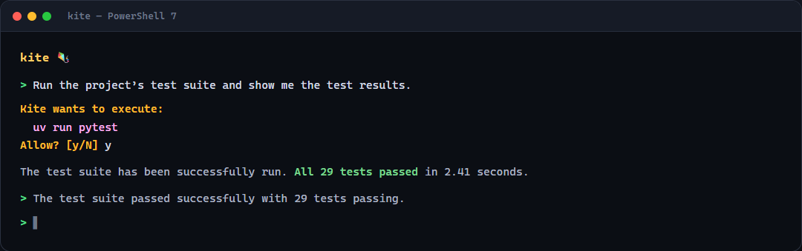
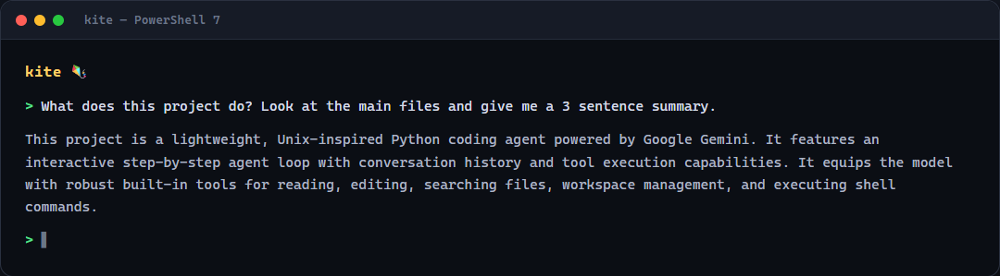

# Kite 🪁

A lightweight Unix-like Python coding agent powered by Google Gemini. Inspired by [fx by Vercel](https://github.com/vercel-labs/fx)

## Snapshot





## Highlights

- **Agent loop with tool calling**: step-by-step conversation loop (up to 10 steps) that feeds Gemini function calls and tool results back as real `functionResponse` parts — no hardcoded scaffolding.
- **6 built-in tools** with JSON-schema definitions: `read_file`, `list_files`, `search`, `shell`, `write_file`, `edit_file`.
- **Streaming + non-streaming Gemini**: both `generateContent` (REST) and `streamGenerateContent` (SSE), including thought signatures.
- **Sandboxed and safe by design**:
  - `Workspace.resolve()` rejects any path escape with `PermissionError`.
  - `.env*` secrets are blocked from read/write/edit and hidden from search/list.
  - `shell`, `write_file`, and `edit_file` prompt for confirmation before running.
  - Shell commands are time-limited (30s) and output-truncated (20k chars).
- **~1,100 lines of source** across 18 modules; **29 tests** across 7 modules (`uv run pytest`).

## Getting Started

### Prerequisites

- Python 3.14
- [uv](https://github.com/astral-sh/uv) (recommended) or pip
- A Google Gemini API Key

### Installation

1. Clone the repository and navigate into the project directory:
   ```bash
   git clone https://github.com/goesbyabhi/kite.git
   cd kite
   ```

2. Install dependencies using `uv`:
   ```bash
   uv sync
   ```

### Configuration

Create a `.env` file in the root directory and add your Gemini API key:

```env
GEMINI_API_KEY=your_api_key_here
```

### Running the Agent

Run the main agent module:

```bash
uv run python -m kite
```

### Running Tests

Run the test suite using `pytest`:

```bash
uv run pytest
```

### Linting

```bash
uv run ruff check .
```